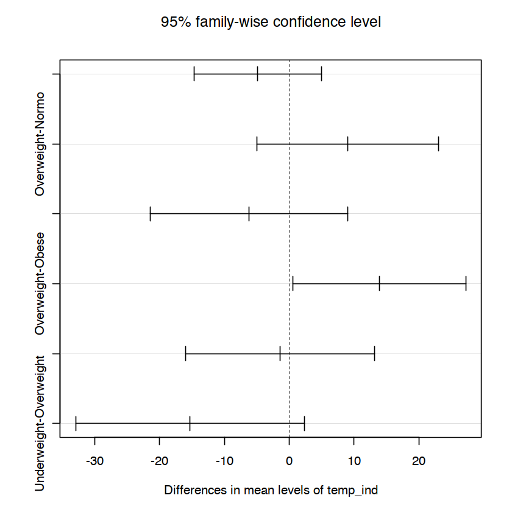

# BMI Data Analysis in R.
Created by: Kiran Mainali


```R
# Read the data from the excel file which was converted to csv file:
data = read.csv("Data.csv")
```


```R
head(data)
```


<table class="dataframe">
<caption>A data.frame: 6 × 26</caption>
<thead>
	<tr><th></th><th scope=col>Project.Hospital..ICU.Identifier</th><th scope=col>Pt.Age</th><th scope=col>Pt.Sex</th><th scope=col>Pt.Sex.Stat.Form..M.1..F.2.</th><th scope=col>Pt.BMI</th><th scope=col>BMI.Classification</th><th scope=col>BMI.Stat.Form...1.Under..0.Norm..1.Over..2.Obese.</th><th scope=col>Co.Morbidities..Asthma...1..DM...2..Obesity...3..Stat.Form</th><th scope=col>Co.Morbidities..0.or.1.or.2.or.3..</th><th scope=col>AKI.by.pRIFLE</th><th scope=col>⋯</th><th scope=col>Mortality.Stat.Form</th><th scope=col>Meet.Criteria.for.MIS.C</th><th scope=col>MIS.C.Stat.Form</th><th scope=col>PIMC.PICU.Admission</th><th scope=col>PICU.Admission.Stat.Form</th><th scope=col>PELOD.Score</th><th scope=col>PRISM.III.Score</th><th scope=col>C.reactive.protein..CRP...Highest..within.24.hours..Day.0..mg.dL.</th><th scope=col>CRP.Elevated</th><th scope=col>C.reactive.protein..CRP...Highest..within.24.hours..Day.1..mg.dL.</th></tr>
	<tr><th></th><th scope=col>&lt;chr&gt;</th><th scope=col>&lt;chr&gt;</th><th scope=col>&lt;chr&gt;</th><th scope=col>&lt;int&gt;</th><th scope=col>&lt;dbl&gt;</th><th scope=col>&lt;chr&gt;</th><th scope=col>&lt;int&gt;</th><th scope=col>&lt;chr&gt;</th><th scope=col>&lt;int&gt;</th><th scope=col>&lt;chr&gt;</th><th scope=col>⋯</th><th scope=col>&lt;int&gt;</th><th scope=col>&lt;chr&gt;</th><th scope=col>&lt;int&gt;</th><th scope=col>&lt;chr&gt;</th><th scope=col>&lt;int&gt;</th><th scope=col>&lt;int&gt;</th><th scope=col>&lt;int&gt;</th><th scope=col>&lt;dbl&gt;</th><th scope=col>&lt;int&gt;</th><th scope=col>&lt;dbl&gt;</th></tr>
</thead>
<tbody>
	<tr><th scope=row>1</th><td>2123-1</td><td>9     </td><td>Female</td><td>2</td><td>14.6</td><td>Normo</td><td>0</td><td>0  </td><td>0</td><td>N</td><td>⋯</td><td>0</td><td>N</td><td>0</td><td>PIMC     </td><td>0</td><td>NA</td><td>NA</td><td>   4.11</td><td> 1</td><td>-999.00</td></tr>
	<tr><th scope=row>2</th><td>2123-2</td><td>15    </td><td>Female</td><td>2</td><td>30.9</td><td>Obese</td><td>2</td><td>2,3</td><td>2</td><td>Y</td><td>⋯</td><td>1</td><td>N</td><td>0</td><td>PICU     </td><td>1</td><td> 7</td><td>26</td><td>   3.09</td><td> 1</td><td>   2.43</td></tr>
	<tr><th scope=row>3</th><td>2123-4</td><td>5M 29D</td><td>Male  </td><td>1</td><td>16.5</td><td>Normo</td><td>0</td><td>0  </td><td>0</td><td>N</td><td>⋯</td><td>0</td><td>N</td><td>0</td><td>Med Floor</td><td>0</td><td>NA</td><td>10</td><td>-999.00</td><td>NA</td><td>-999.00</td></tr>
	<tr><th scope=row>4</th><td>2123-5</td><td>7     </td><td>Female</td><td>2</td><td>16.9</td><td>Normo</td><td>0</td><td>0  </td><td>0</td><td>N</td><td>⋯</td><td>0</td><td>Y</td><td>1</td><td>PICU     </td><td>1</td><td> 6</td><td>10</td><td>  24.74</td><td> 1</td><td>  24.70</td></tr>
	<tr><th scope=row>5</th><td>2123-6</td><td>9M 6D </td><td>Female</td><td>2</td><td>22.1</td><td>Obese</td><td>2</td><td>3  </td><td>1</td><td>Y</td><td>⋯</td><td>0</td><td>N</td><td>0</td><td>PIMC     </td><td>0</td><td>NA</td><td>10</td><td>  11.10</td><td> 1</td><td>   5.38</td></tr>
	<tr><th scope=row>6</th><td>2123-7</td><td>7M 26D</td><td>Female</td><td>2</td><td>16.2</td><td>Normo</td><td>0</td><td>0  </td><td>0</td><td>Y</td><td>⋯</td><td>0</td><td>N</td><td>0</td><td>PICU     </td><td>1</td><td> 4</td><td> 9</td><td>-999.00</td><td>NA</td><td>-999.00</td></tr>
</tbody>
</table>


```R
tail(data)
```


<table class="dataframe">
<caption>A data.frame: 6 × 26</caption>
<thead>
	<tr><th></th><th scope=col>Project.Hospital..ICU.Identifier</th><th scope=col>Pt.Age</th><th scope=col>Pt.Sex</th><th scope=col>Pt.Sex.Stat.Form..M.1..F.2.</th><th scope=col>Pt.BMI</th><th scope=col>BMI.Classification</th><th scope=col>BMI.Stat.Form...1.Under..0.Norm..1.Over..2.Obese.</th><th scope=col>Co.Morbidities..Asthma...1..DM...2..Obesity...3..Stat.Form</th><th scope=col>Co.Morbidities..0.or.1.or.2.or.3..</th><th scope=col>AKI.by.pRIFLE</th><th scope=col>⋯</th><th scope=col>Mortality.Stat.Form</th><th scope=col>Meet.Criteria.for.MIS.C</th><th scope=col>MIS.C.Stat.Form</th><th scope=col>PIMC.PICU.Admission</th><th scope=col>PICU.Admission.Stat.Form</th><th scope=col>PELOD.Score</th><th scope=col>PRISM.III.Score</th><th scope=col>C.reactive.protein..CRP...Highest..within.24.hours..Day.0..mg.dL.</th><th scope=col>CRP.Elevated</th><th scope=col>C.reactive.protein..CRP...Highest..within.24.hours..Day.1..mg.dL.</th></tr>
	<tr><th></th><th scope=col>&lt;chr&gt;</th><th scope=col>&lt;chr&gt;</th><th scope=col>&lt;chr&gt;</th><th scope=col>&lt;int&gt;</th><th scope=col>&lt;dbl&gt;</th><th scope=col>&lt;chr&gt;</th><th scope=col>&lt;int&gt;</th><th scope=col>&lt;chr&gt;</th><th scope=col>&lt;int&gt;</th><th scope=col>&lt;chr&gt;</th><th scope=col>⋯</th><th scope=col>&lt;int&gt;</th><th scope=col>&lt;chr&gt;</th><th scope=col>&lt;int&gt;</th><th scope=col>&lt;chr&gt;</th><th scope=col>&lt;int&gt;</th><th scope=col>&lt;int&gt;</th><th scope=col>&lt;int&gt;</th><th scope=col>&lt;dbl&gt;</th><th scope=col>&lt;int&gt;</th><th scope=col>&lt;dbl&gt;</th></tr>
</thead>
<tbody>
	<tr><th scope=row>72</th><td>2123-74</td><td>1 </td><td>Male  </td><td>1</td><td>34.6</td><td>Obese      </td><td> 2</td><td>3</td><td>1</td><td>Y</td><td>⋯</td><td>1</td><td>N</td><td>0</td><td>PICU</td><td>1</td><td> 0</td><td>17</td><td>-999.00</td><td>NA</td><td>-999</td></tr>
	<tr><th scope=row>73</th><td>2123-75</td><td>13</td><td>Female</td><td>2</td><td>46.3</td><td>Obese      </td><td> 2</td><td>3</td><td>1</td><td>N</td><td>⋯</td><td>0</td><td>N</td><td>0</td><td>PICU</td><td>1</td><td> 2</td><td>14</td><td>   2.03</td><td>NA</td><td>-999</td></tr>
	<tr><th scope=row>74</th><td>2123-76</td><td>4 </td><td>Male  </td><td>1</td><td>15.8</td><td>Normo      </td><td> 0</td><td>1</td><td>1</td><td>N</td><td>⋯</td><td>0</td><td>Y</td><td>1</td><td>PICU</td><td>1</td><td> 1</td><td>10</td><td>   6.86</td><td>NA</td><td>-999</td></tr>
	<tr><th scope=row>75</th><td>2123-77</td><td>16</td><td>Male  </td><td>1</td><td>26.8</td><td>Overweight </td><td> 1</td><td>0</td><td>0</td><td>Y</td><td>⋯</td><td>0</td><td>Y</td><td>1</td><td>PICU</td><td>1</td><td> 1</td><td>19</td><td>  31.15</td><td>NA</td><td>-999</td></tr>
	<tr><th scope=row>76</th><td>2123-78</td><td>5 </td><td>Male  </td><td>1</td><td>12.2</td><td>Underweight</td><td>-1</td><td>0</td><td>0</td><td>N</td><td>⋯</td><td>0</td><td>N</td><td>0</td><td>PMC </td><td>0</td><td>NA</td><td>NA</td><td>-999.00</td><td>NA</td><td>-999</td></tr>
	<tr><th scope=row>77</th><td>2123-79</td><td>11</td><td>Male  </td><td>1</td><td>28.9</td><td>Obese      </td><td> 2</td><td>3</td><td>1</td><td>N</td><td>⋯</td><td>0</td><td>N</td><td>0</td><td>PICU</td><td>1</td><td> 2</td><td> 2</td><td>-999.00</td><td>NA</td><td>-999</td></tr>
</tbody>
</table>


## Relation between BMI classification and hospital discharge status.
Removing the White space from the data columns that we are interested in. Here we will be applying the logistic regression to check whether BMI classification has any significance to the patient's discharge status (Discharged Vs. Expired). In this regard, we are considering BMI classifications as independent variables and discharge status as a dependent variables.


```R
temp_ind = trimws(data$BMI.Classification, which = c("both"))
temp_dep = trimws(data$Outcome.Mortality, which = c("both"))
```

Now, we change the independent variables (BMI Classification) to the binary dummy variables.


```R
library(varhandle)
binary_independent = to.dummy(temp_ind, "ind")
```


```R
head(binary_independent)
```


<table class="dataframe">
<caption>A matrix: 6 × 4 of type dbl</caption>
<thead>
	<tr><th scope=col>ind.Normo</th><th scope=col>ind.Obese</th><th scope=col>ind.Overweight</th><th scope=col>ind.Underweight</th></tr>
</thead>
<tbody>
	<tr><td>1</td><td>0</td><td>0</td><td>0</td></tr>
	<tr><td>0</td><td>1</td><td>0</td><td>0</td></tr>
	<tr><td>1</td><td>0</td><td>0</td><td>0</td></tr>
	<tr><td>1</td><td>0</td><td>0</td><td>0</td></tr>
	<tr><td>0</td><td>1</td><td>0</td><td>0</td></tr>
	<tr><td>1</td><td>0</td><td>0</td><td>0</td></tr>
</tbody>
</table>


Changing the dependent variables to binary (0 and 1). We are expressing 1 as Expired and 0 as Discharged.


```R
dependent <- data.frame( dependent = temp_dep, stringsAsFactors = FALSE)

lookup <- c("Expired" = 1, "Discharged" = 0)

dependent$Binary <- lookup[dependent$dependent]
```


```R
head(dependent)
```


<table class="dataframe">
<caption>A data.frame: 6 × 2</caption>
<thead>
	<tr><th></th><th scope=col>dependent</th><th scope=col>Binary</th></tr>
	<tr><th></th><th scope=col>&lt;chr&gt;</th><th scope=col>&lt;dbl&gt;</th></tr>
</thead>
<tbody>
	<tr><th scope=row>1</th><td>Discharged</td><td>0</td></tr>
	<tr><th scope=row>2</th><td>Expired   </td><td>1</td></tr>
	<tr><th scope=row>3</th><td>Discharged</td><td>0</td></tr>
	<tr><th scope=row>4</th><td>Discharged</td><td>0</td></tr>
	<tr><th scope=row>5</th><td>Discharged</td><td>0</td></tr>
	<tr><th scope=row>6</th><td>Discharged</td><td>0</td></tr>
</tbody>
</table>


## Model Fitting

In order to fit the logistic regression in R, we are not required to change the independent variables into dummy variables since R automatically recognizes them and perform the analysis. But we do require to change the dependent into binary form. First, we fit the model `mod.fit.simple` using categorical independent variable `temp_ind`.


```R
mod.fit.simple = glm(formula = dependent[, 2] ~ temp_ind, family = binomial(link = logit))

summary(mod.fit.simple)
```


    
    Call:
    glm(formula = dependent[, 2] ~ temp_ind, family = binomial(link = logit))
    
    Deviance Residuals: 
         Min        1Q    Median        3Q       Max  
    -0.75853  -0.40011  -0.40011  -0.00005   2.26493  
    
    Coefficients:
                          Estimate Std. Error z value Pr(>|z|)
    (Intercept)         -2.057e+01  3.697e+03  -0.006    0.996
    temp_indObese        1.808e+01  3.697e+03   0.005    0.996
    temp_indOverweight   1.947e+01  3.697e+03   0.005    0.996
    temp_indUnderweight -4.393e-08  7.654e+03   0.000    1.000
    
    (Dispersion parameter for binomial family taken to be 1)
    
        Null deviance: 37.012  on 76  degrees of freedom
    Residual deviance: 30.150  on 73  degrees of freedom
    AIC: 38.15
    
    Number of Fisher Scoring iterations: 19


**R** Considers, `temp_indNormal` as a reference group and rest of the three as a comparision groups. This is due to dummy variable traps or multicollinearity. More information can be found
[here](https://www.algosome.com/articles/dummy-variable-trap-regression.html#:~:text=The%20Dummy%20Variable%20trap%20is,be%20predicted%20from%20the%20others.). 

Now, we form a data `main` that contains dependent and independent variables in one data frame for manual analysis for hypothesis testing.


```R
main = data.frame(dependent[, 2], binary_independent[, 1], binary_independent[, 2], binary_independent[, 3], binary_independent[, 4])
colnames(main) = c("Outcome", "Normal", "Obese", "Overweight", "Underweight")
```


```R
head(main)
```


<table class="dataframe">
<caption>A data.frame: 6 × 5</caption>
<thead>
	<tr><th></th><th scope=col>Outcome</th><th scope=col>Normal</th><th scope=col>Obese</th><th scope=col>Overweight</th><th scope=col>Underweight</th></tr>
	<tr><th></th><th scope=col>&lt;dbl&gt;</th><th scope=col>&lt;dbl&gt;</th><th scope=col>&lt;dbl&gt;</th><th scope=col>&lt;dbl&gt;</th><th scope=col>&lt;dbl&gt;</th></tr>
</thead>
<tbody>
	<tr><th scope=row>1</th><td>0</td><td>1</td><td>0</td><td>0</td><td>0</td></tr>
	<tr><th scope=row>2</th><td>1</td><td>0</td><td>1</td><td>0</td><td>0</td></tr>
	<tr><th scope=row>3</th><td>0</td><td>1</td><td>0</td><td>0</td><td>0</td></tr>
	<tr><th scope=row>4</th><td>0</td><td>1</td><td>0</td><td>0</td><td>0</td></tr>
	<tr><th scope=row>5</th><td>0</td><td>0</td><td>1</td><td>0</td><td>0</td></tr>
	<tr><th scope=row>6</th><td>0</td><td>1</td><td>0</td><td>0</td><td>0</td></tr>
</tbody>
</table>


## Hypothesis Testing:

Consider a model: $$ \text{logit}(\pi) = \beta_0 + \beta_1 \text{normal} .$$

The null and alternative hypothesis can be expressed as:
$$ H_0: \beta_1 = 0$$ Vs. $$ H_a: \beta_1 \neq 0 .$$
The above statemet can equivalently expressed as:
$$H_0:\text{logit}(\pi) = \beta_0$$ Vs. $$H_a:\text{logit}(\pi) = \beta_0 + \beta_1 \text{normal}.$$


```R
mod.fit1 = glm(formula = Outcome ~ Normal, family = binomial(link = logit), data = main)
summary(mod.fit1)
```


    
    Call:
    glm(formula = Outcome ~ Normal, family = binomial(link = logit), 
        data = main)
    
    Deviance Residuals: 
         Min        1Q    Median        3Q       Max  
    -0.44083  -0.44083  -0.44083  -0.00008   2.18153  
    
    Coefficients:
                 Estimate Std. Error z value Pr(>|z|)    
    (Intercept)   -2.2824     0.4695  -4.862 1.16e-06 ***
    Normal       -17.2837  2242.3668  -0.008    0.994    
    ---
    Signif. codes:  0 ‘***’ 0.001 ‘**’ 0.01 ‘*’ 0.05 ‘.’ 0.1 ‘ ’ 1
    
    (Dispersion parameter for binomial family taken to be 1)
    
        Null deviance: 37.012  on 76  degrees of freedom
    Residual deviance: 33.318  on 75  degrees of freedom
    AIC: 37.318
    
    Number of Fisher Scoring iterations: 18


From the result that we get from the summary, `Normal` BMI level has no significance on mortality status at 5% significance level, i.e., we failed to reject the null hypothesis at 5% level of significance. 

**Consider a model:** $$ \text{logit}(\pi) = \beta_0 + \beta_1 \text{obese} + \beta_2 \text{normal}.$$

The null and alternative hypothesis can be expressed as:
$$ H_0: \beta_1 = 0$$ Vs. $$ H_a: \beta_1 \neq 0 .$$
The above statemet can equivalently expressed as:
$$H_0:\text{logit}(\pi) = \beta_0+ \beta_1 \text{normal} $$ Vs. $$H_a:\text{logit}(\pi) = \beta_0 + \beta_1 \text{obese} + \beta_2 \text{normal}.$$


```R
mod.fit2 = glm(formula = Outcome ~ Normal + Obese, family = binomial(link = logit), data = main)
summary(mod.fit2)
```


    
    Call:
    glm(formula = Outcome ~ Normal + Obese, family = binomial(link = logit), 
        data = main)
    
    Deviance Residuals: 
         Min        1Q    Median        3Q       Max  
    -0.53498  -0.40011  -0.40011  -0.00008   2.26493  
    
    Coefficients:
                 Estimate Std. Error z value Pr(>|z|)  
    (Intercept)   -1.8718     0.7596  -2.464   0.0137 *
    Normal       -17.6943  2242.3668  -0.008   0.9937  
    Obese         -0.6131     0.9685  -0.633   0.5267  
    ---
    Signif. codes:  0 ‘***’ 0.001 ‘**’ 0.01 ‘*’ 0.05 ‘.’ 0.1 ‘ ’ 1
    
    (Dispersion parameter for binomial family taken to be 1)
    
        Null deviance: 37.012  on 76  degrees of freedom
    Residual deviance: 32.933  on 74  degrees of freedom
    AIC: 38.933
    
    Number of Fisher Scoring iterations: 18


From the result that we get from the summary, `Obese` BMI level has no significance on mortality status given that `Normal` is in the model at 5% significance level, i.e., we failed to reject the null hypothesis at 5% level of significance. 

**Consider a model:** $$ \text{logit}(\pi) = \beta_0 + \beta_1 \text{overweight} + \beta_2 \text{normal} + \beta_3 \text{obese}.$$

The null and alternative hypothesis can be expressed as:
$$ H_0: \beta_1 = 0$$ Vs. $$ H_a: \beta_1 \neq 0 .$$
The above statemet can equivalently expressed as:
$$H_0:\text{logit}(\pi) = \beta_0 + \beta_2 \text{normal} + \beta_3 \text{obese} $$ Vs. $$H_a:\text{logit}(\pi) = \beta_0 + \beta_1 \text{overweight} + \beta_2 \text{normal} + \beta_3 \text{obese}.$$


```R
mod.fit3 = glm(formula = Outcome ~ Normal + Obese + Overweight, family = binomial(link = logit), data = main)
summary(mod.fit3)
```


    
    Call:
    glm(formula = Outcome ~ Normal + Obese + Overweight, family = binomial(link = logit), 
        data = main)
    
    Deviance Residuals: 
         Min        1Q    Median        3Q       Max  
    -0.75853  -0.40011  -0.40011  -0.00005   2.26493  
    
    Coefficients:
                  Estimate Std. Error z value Pr(>|z|)
    (Intercept) -2.057e+01  6.701e+03  -0.003    0.998
    Normal       3.876e-08  7.654e+03   0.000    1.000
    Obese        1.808e+01  6.701e+03   0.003    0.998
    Overweight   1.947e+01  6.701e+03   0.003    0.998
    
    (Dispersion parameter for binomial family taken to be 1)
    
        Null deviance: 37.012  on 76  degrees of freedom
    Residual deviance: 30.150  on 73  degrees of freedom
    AIC: 38.15
    
    Number of Fisher Scoring iterations: 19


From the result that we get from the summary, `Overweight` BMI level has no significance on mortality status given that `Normal` and `obese` are in the model at 5% significance level, i.e., we failed to reject the null hypothesis at 5% level of significance. 

*The above analysis shows that the BMI classification has no significance on mortality outcome.*

## Chi-square test of Independence


```R
# We first form the table for better visualization of dependent and independent variables:
data_table = table(temp_ind, temp_dep, dnn = c("BMI Status", "Discharge Status"))
```


```R
data_table
```


                 Discharge Status
    BMI Status    Discharged Expired
      Normo               23       0
      Obese               36       3
      Overweight           6       2
      Underweight          7       0


```R
#install.packages("gplots")
```


```R
library("gplots")

balloonplot(t(data_table), xlab ="", ylab="",
            label = FALSE, show.margins = FALSE)
```

    
    Attaching package: ‘gplots’
    
    
    The following object is masked from ‘package:stats’:
    
        lowess
    
    


    

    


```R
# Equation numbering
```

Null and alternative hypothesis for chi-square test of independence:

$
\begin{eqnarray*}
 H_0 & :& \text{the row and the column variables of the contingency table are independent.} \\
 H_a & :& \text{row and column variables are dependent.}
 \label{null} \tag{2}
\end{eqnarray*}
$

Further information can be found on $\eqref{null}$


```R
chisq_test = chisq.test(data_table, correct = FALSE) #chisq.test(temp_ind, temp_dep)
# Correct = False to prevent a continuity correction form being applied.
```

    Warning message in chisq.test(data_table, correct = FALSE):
    “Chi-squared approximation may be incorrect”


```R
chisq_test
```


    
    	Pearson's Chi-squared test
    
    data:  data_table
    X-squared = 6.6881, df = 3, p-value = 0.08253


```R
names(chisq_test)
```


<style>
.list-inline {list-style: none; margin:0; padding: 0}
.list-inline>li {display: inline-block}
.list-inline>li:not(:last-child)::after {content: "\00b7"; padding: 0 .5ex}
</style>
<ol class=list-inline><li>'statistic'</li><li>'parameter'</li><li>'p.value'</li><li>'method'</li><li>'data.name'</li><li>'observed'</li><li>'expected'</li><li>'residuals'</li><li>'stdres'</li></ol>


```R
sprintf("The p-value for the test =  %f.", chisq_test$p.value)
```


<span style=white-space:pre-wrap>'The p-value for the test =  0.082531.'</span>


Using the Chi-square test of independence, we failed to reject the null hypothesis at 5% significance level, i.e., there is no statistical evidence that the BMI classification is dependent on discharge status of the patient.


```R
chisq_test$observed
```


                 Discharge Status
    BMI Status    Discharged Expired
      Normo               23       0
      Obese               36       3
      Overweight           6       2
      Underweight          7       0


```R
chisq_test$expected
```


<table class="dataframe">
<caption>A matrix: 4 × 2 of type dbl</caption>
<thead>
	<tr><th></th><th scope=col>Discharged</th><th scope=col>Expired</th></tr>
</thead>
<tbody>
	<tr><th scope=row>Normo</th><td>21.506494</td><td>1.4935065</td></tr>
	<tr><th scope=row>Obese</th><td>36.467532</td><td>2.5324675</td></tr>
	<tr><th scope=row>Overweight</th><td> 7.480519</td><td>0.5194805</td></tr>
	<tr><th scope=row>Underweight</th><td> 6.545455</td><td>0.4545455</td></tr>
</tbody>
</table>


```R
chisq_test$residual
```


                 Discharge Status
    BMI Status     Discharged     Expired
      Normo        0.32204926 -1.22209103
      Obese       -0.07742097  0.29379191
      Overweight  -0.54131274  2.05413741
      Underweight  0.17766726 -0.67419986


Let’s visualize Pearson residuals using the package corrplot:


```R
#install.packages("corrplot")
```


```R
library(corrplot)
corrplot(chisq_test$residuals, is.cor = FALSE)
```

    corrplot 0.84 loaded
    


    

    


Positive residuals are in blue. Positive values in cells specify an attraction (positive association) between the corresponding row and column variables.
1. In the image above, it’s evident that there is strong association between the column Expired and the row Overweight.

2. Negative residuals are in red. This implies a repulsion (negative association) between the corresponding row and column variables. For example the column Expired is negatively associated (~ “not associated”) with the row Normo. 

Another method for applying the same test using vcd package to check the statistic and p-value using likelihood ratio test (LRT):


```R
#install.packages("vcd")
```


```R
library(package = vcd)
```

    Loading required package: grid
    


```R
assocstats(x = data_table)
```


                        X^2 df P(> X^2)
    Likelihood Ratio 6.8616  3 0.076442
    Pearson          6.6881  3 0.082531
    
    Phi-Coefficient   : NA 
    Contingency Coeff.: 0.283 
    Cramer's V        : 0.295 


## Fisher's Exact Test:


```R
fisher.test(temp_ind, temp_dep)
```


    
    	Fisher's Exact Test for Count Data
    
    data:  temp_ind and temp_dep
    p-value = 0.09897
    alternative hypothesis: two.sided


**Conclusion:** Using Ch-square or Fisher's test, there are no statistical evidence to claim the dependency between BMI classification and mortality.

**We now perform individual study of BMI Classification and Mortality:**


```R
data_BMI = data.frame(temp_ind, temp_dep)
```


```R
head(data_BMI)
```


<table class="dataframe">
<caption>A data.frame: 6 × 2</caption>
<thead>
	<tr><th></th><th scope=col>temp_ind</th><th scope=col>temp_dep</th></tr>
	<tr><th></th><th scope=col>&lt;chr&gt;</th><th scope=col>&lt;chr&gt;</th></tr>
</thead>
<tbody>
	<tr><th scope=row>1</th><td>Normo</td><td>Discharged</td></tr>
	<tr><th scope=row>2</th><td>Obese</td><td>Expired   </td></tr>
	<tr><th scope=row>3</th><td>Normo</td><td>Discharged</td></tr>
	<tr><th scope=row>4</th><td>Normo</td><td>Discharged</td></tr>
	<tr><th scope=row>5</th><td>Obese</td><td>Discharged</td></tr>
	<tr><th scope=row>6</th><td>Normo</td><td>Discharged</td></tr>
</tbody>
</table>


**We now filter the data with Obese BMI only.**


```R
data_BMI_obese = filter(data_BMI, temp_ind == "Obese")
```


```R
sprintf("Total number of patient having Obese BMI = %d.", nrow(data_BMI_obese))
```


'Total number of patient having Obese BMI = 77.'


```R
data_BMI_obese_table = table(data_BMI_obese)
```


```R
data_BMI_obese_table
```


    data_BMI_obese
    41 78 
     1  1 


```R
chisq_test_obese = chisq.test(data_BMI_obese_table)
```

    Warning message in chisq.test(data_BMI_obese_table):
    “Chi-squared approximation may be incorrect”


```R
sprintf("p-value of the test = %0.9f.", chisq_test_obese$p.value)
```


'p-value of the test = 1.000000000.'


**There is strong dependency between Obesity and mortality at 5% level of significance.**

**Also, all the patient with normal BMI were discharged, so ther is nothing to compare between these two variables.**

# MIS-C and BMI Classification Relation:


```R
data_MISC = data.frame(temp_ind, data$MIS.C.Stat.Form)
```


```R
colnames(data_MISC) = c("temp_ind", "MIS_C")
head(data_MISC)
```


<table class="dataframe">
<caption>A data.frame: 6 × 2</caption>
<thead>
	<tr><th></th><th scope=col>temp_ind</th><th scope=col>MIS_C</th></tr>
	<tr><th></th><th scope=col>&lt;chr&gt;</th><th scope=col>&lt;int&gt;</th></tr>
</thead>
<tbody>
	<tr><th scope=row>1</th><td>Normo</td><td>0</td></tr>
	<tr><th scope=row>2</th><td>Obese</td><td>0</td></tr>
	<tr><th scope=row>3</th><td>Normo</td><td>0</td></tr>
	<tr><th scope=row>4</th><td>Normo</td><td>1</td></tr>
	<tr><th scope=row>5</th><td>Obese</td><td>0</td></tr>
	<tr><th scope=row>6</th><td>Normo</td><td>0</td></tr>
</tbody>
</table>


```R
data_MISC_table = table(data_MISC)
data_MISC_table
```


                 MIS_C
    temp_ind       0  1
      Normo       18  5
      Obese       37  2
      Overweight   5  3
      Underweight  6  1


```R
chisq_test_data_MISC = chisq.test(data_MISC_table)
chisq_test_data_MISC
```

    Warning message in chisq.test(data_MISC_table):
    “Chi-squared approximation may be incorrect”


    
    	Pearson's Chi-squared test
    
    data:  data_MISC_table
    X-squared = 7.2353, df = 3, p-value = 0.06477


```R
chisq_test_data_MISC$expected
```


<table class="dataframe">
<caption>A matrix: 4 × 2 of type dbl</caption>
<thead>
	<tr><th></th><th scope=col>0</th><th scope=col>1</th></tr>
</thead>
<tbody>
	<tr><th scope=row>Normo</th><td>19.714286</td><td>3.285714</td></tr>
	<tr><th scope=row>Obese</th><td>33.428571</td><td>5.571429</td></tr>
	<tr><th scope=row>Overweight</th><td> 6.857143</td><td>1.142857</td></tr>
	<tr><th scope=row>Underweight</th><td> 6.000000</td><td>1.000000</td></tr>
</tbody>
</table>


```R
corrplot(chisq_test_data_MISC$residuals, is.cor = FALSE)
```


    

    


Since many expected counts are less than 5, we use Fisher's exact test.


```R
Fisher_test_data_MISC = fisher.test(data_MISC_table)
```


```R
Fisher_test_data_MISC
```


    
    	Fisher's Exact Test for Count Data
    
    data:  data_MISC_table
    p-value = 0.03526
    alternative hypothesis: two.sided


*At 5% level of significance, BMI classification and MIS_C are dependent.*

Next, we run logistic regression.


```R
model_MISC = glm(formula = MIS_C ~ temp_ind, family = binomial(link = logit), data = data_MISC)
```


```R
summary(model_MISC)
```


    
    Call:
    glm(formula = MIS_C ~ temp_ind, family = binomial(link = logit), 
        data = data_MISC)
    
    Deviance Residuals: 
        Min       1Q   Median       3Q      Max  
    -0.9695  -0.7002  -0.3245  -0.3245   2.4374  
    
    Coefficients:
                        Estimate Std. Error z value Pr(>|z|)  
    (Intercept)          -1.2809     0.5055  -2.534   0.0113 *
    temp_indObese        -1.6368     0.8846  -1.850   0.0643 .
    temp_indOverweight    0.7701     0.8882   0.867   0.3859  
    temp_indUnderweight  -0.5108     1.1926  -0.428   0.6684  
    ---
    Signif. codes:  0 ‘***’ 0.001 ‘**’ 0.01 ‘*’ 0.05 ‘.’ 0.1 ‘ ’ 1
    
    (Dispersion parameter for binomial family taken to be 1)
    
        Null deviance: 63.158  on 76  degrees of freedom
    Residual deviance: 56.189  on 73  degrees of freedom
    AIC: 64.189
    
    Number of Fisher Scoring iterations: 5


From the summary, it can be seen that obesity is more significant on `MIS_C` value compared to others.

Next, we check the relation of individual BMI category to `MIS_C` value.


```R
data_MISC_normal = filter(data_MISC, temp_ind == "Normo")
```


```R
sprintf("Total number of patient with Normal BMI = %d and patient with MIS_C 1 = %d.", nrow(data_MISC_normal), sum(data_MISC_normal$MIS_C))
```


    Error in data_MISC_normal$MIS_C: $ operator is invalid for atomic vectors
    Traceback:


    1. sprintf("Total number of patient with Normal BMI = %d and patient with MIS_C 1 = %d.", 
     .     nrow(data_MISC_normal), sum(data_MISC_normal$MIS_C))


```R
data_MISC_normal_table = table(data_MISC_normal)
data_MISC_normal_table
```


```R
chisq_test_data_MISC_normal = chisq.test(data_MISC_normal_table)
chisq_test_data_MISC_normal
```

*`Normal` and `MIS_C` are dependent at 5% level of significance.*


```R
data_MISC_obese = filter(data_MISC, temp_ind == "Obese")
```


```R
sprintf("Total number of patient with Obese BMI = %d and patient with MIS_C 1 = %d.", nrow(data_MISC_obese), sum(data_MISC_normal$MIS_C))
```


```R
data_MISC_obese_table = table(data_MISC_obese)
data_MISC_obese_table
```


```R
chisq_test_data_MISC_obese = chisq.test(data_MISC_obese_table)
chisq_test_data_MISC_obese
```


```R
sprintf("The p-value for the test is %0.8f.", chisq_test_data_MISC_obese$p.value)
```

*`Obese` and `MIS_C` are dependent at 5% level of significance.*


```R

```

## Multinomial Logistic regression and Independence test
We first extract the data column regarding BMI classification and Co-morbodities:


```R
data2 = data.frame(temp_ind, data["Co.Morbidities..0.or.1.or.2.or.3.."])
colnames(data2) = c("BMI_Status", "Comorbodities")
```


```R
# Transforming numeric to categorical for Comorbodities column:
data2$Comorbodities[data2$Comorbodities == 0] = "None"
data2$Comorbodities[data2$Comorbodities == 1] = "Asthma"
data2$Comorbodities[data2$Comorbodities == 2] = "DM"
data2$Comorbodities[data2$Comorbodities == 3] = "Obesity"
```


```R
head(data2)
```

### Chi-Square test of Independence


```R
data_table2 = table(data2)
data_table2
```


```R
library("gplots")

balloonplot(t(data_table2), xlab ="", ylab="",
            label = FALSE, show.margins = FALSE)
```


```R
chisq_test2 = chisq.test(data_table2, correct = FALSE)
chisq_test2
```

There is high level of dependencies between BMI classification and Comorbodities at the 5% level of significance.


```R
library(corrplot)
corrplot(chisq_test2$residuals, is.cor = FALSE)
```

### Multinomial Logistic Regression


```R
library(package = nnet)

mod2.fit = multinom(formula = Comorbodities ~ BMI_Status, data = data2)

summary(mod2.fit)
```


```R
#install.packages("tidyverse")
```


```R
#install.packages("car")
```


```R
library(package = car)
Anova(mod2.fit)
```

## Relation between BMI Classification and Acute Kidney Injury (AKI):
Dependent Variable: AKI Profile \[0 = No AKI, 1 = Prevalance of AKI\]

Independent vriable: BMI Classification


```R
data3 = data.frame(temp_ind, data["AKI.Stat.Form"])
colnames(data3) = c("BMI_Status", "AKI_Profile")
```


```R
head(data3)
```


```R
data_table3 = table(data3)
colnames(data_table3) = c("AKI = 0", "AKI = 1")
colnames(data_table3)
```


```R
balloonplot(t(data_table3), xlab ="", ylab="",
            label = FALSE, show.margins = FALSE)
```


```R
chisq_test3 = chisq.test(data_table3, correct = FALSE)
chisq_test3
```

There is no dependency between BMI classification and AKI profile at the 5% level of significance.


```R
library(corrplot)
corrplot(chisq_test3$residuals, is.cor = FALSE)
```

### Logistic Regression for the same Analysis:


```R
mod.fit4 = glm(formula = data$AKI.Stat.Form ~ temp_ind, family = binomial(link = logit))
summary(mod.fit4)
```

The result from logistic regression is also compatible with correlation plot.

*Now we subsample AKI for only Normal Patient:*


```R
#install.packages("tidyverse")
#library(tidyverse)
```


```R
AKI_normal = filter(data3, BMI_Status == "Normo")
head(AKI_normal)
```


```R
sprintf("Total number of patient having Normal BMI = %d.", nrow(AKI_normal))
```


```R
table_AKI_normal = table(AKI_normal)
colnames(table_AKI_normal) = c("AKI = 0", "AKI = 1")
colnames(table_AKI_normal)
```


```R
table_AKI_normal
```


```R
chisq_test_AKI_normal = chisq.test(table_AKI_normal, correct = True)
chisq_test_AKI_normal
```

These two variables are significant at 5% level of significance.

**Now we subsample AKI for only Obese Patient:**


```R
AKI_obese = filter(data3, BMI_Status == "Obese")
head(AKI_obese)
```


```R
sprintf("Total number of patient having Obese BMI = %d.", nrow(AKI_obese))
```


```R
table_AKI_obese = table(AKI_obese)
colnames(table_AKI_obese) = c("AKI = 0", "AKI = 1")
```


```R
table_AKI_obese
```


```R
chisq_test_AKI_obese = chisq.test(table_AKI_obese, correct = False)
chisq_test_AKI_obese
```


```R
sprintf("The p-value for the test = %3.5f", chisq_test_AKI_obese$p.value)
```

These two variables obese and AKI status are dependent at 5% level of significance.

## Relation between BMI Classification and PICU Admission:
Dependent Variable: PICU level \[0 = No PICU Admission, 1 = Admitted to PICU\]

Independent vriable: BMI Classification


```R
data4 = data.frame(temp_ind, data["PICU.Admission.Stat.Form"])
colnames(data4) = c("BMI_Status", "PICU_Status")
```


```R
head(data4)
```


```R
data_table4 = table(data4)
colnames(data_table4) = c("No PICU = 0", "PICU = 1")
```


```R
data_table4
```


```R
balloonplot(t(data_table4), xlab ="", ylab="",
            label = FALSE, show.margins = FALSE)
```


```R
chisq_test4 = chisq.test(data_table4, correct = FALSE)
chisq_test4$expected
```


```R
library(corrplot)
corrplot(chisq_test4$residuals, is.cor = FALSE)
```

## Logistic regression for the same analysis:


```R
mod.fit5 = glm(formula = data$PICU.Admission.Stat.Form ~ temp_ind, family = binomial(link = logit))
summary(mod.fit4)
```

The result from logistic regression is also compatible with correlation plot.

**We perform the analysis between Normal and PICU admission.**


```R
PICU_normal = filter(data4, BMI_Status == "Normo")
head(PICU_normal)
```


```R
sprintf("Total number of patient having Normal BMI = %d with PICU admission patient = %d.", nrow(PICU_normal), sum(PICU_normal$PICU_Status))
```


```R
table_PICU_normal = table(PICU_normal)
colnames(table_PICU_normal) = c("PICU = 0", "PICU = 1")
```


```R
table_PICU_normal
```


```R
chisq_test_PICU_normal = chisq.test(table_PICU_normal, correct = False)
chisq_test_PICU_normal
```


```R
sprintf("The p-value for the test = %0.5f.", chisq_test_PICU_normal$p.value)
```

The relation between Normal BMI and PICU admission is dependent at 5% level of significance.

**Let's check whether the dependence relation is also compatible with logistic regression results!!**


```R
# Filter the normal BMI only from data4
test = (data4$BMI_Status == "Normo") 
```


```R
test[test == "TRUE"] = 1
data4$independent = test
```


```R
head(data4)
```


```R
model = glm(formula = PICU_Status ~ independent, family = binomial(link = logit), data = data4)
summary(model)
```

*We don't see a strong relation between dependent and independent variables using Logistic regression.*

**We perform the analysis between Obese BMI status and PICU admission.**


```R
PICU_obese = filter(data4, BMI_Status == "Obese")
head(PICU_obese)
```


```R
sprintf("Total number of patient having Obese BMI = %d with PICU admission patient = %d.", nrow(PICU_obese), sum(PICU_obese$PICU_Status))
```


```R
table_PICU_obese = table(PICU_obese)
colnames(table_PICU_obese) = c("PICU = 0", "PICU = 1")
table_PICU_obese
```


```R
chisq_test_PICU_obese = chisq.test(table_PICU_obese, correct = False)
chisq_test_PICU_obese
```


```R
sprintf("The p-value for the test = %0.5f.", chisq_test_PICU_obese$p.value)
```

There is independent relation between Obese BMI and PICU admissio at 5% level of significance.

## Relation between BMI classification and Length of Stay (LOS):
Dependent Variable: Length of stay in hospital.

Independent vriable: BMI Classification


```R
data5 = data.frame(temp_ind, data["Length.of.Stay..LOS."])
colnames(data5) = c("BMI_Status", "LOS")
```


```R
mod.fit6 = lm(formula = LOS ~ BMI_Status, data = data5)
summary(mod.fit6)
```


    
    Call:
    lm(formula = LOS ~ BMI_Status, data = data5)
    
    Residuals:
       Min     1Q Median     3Q    Max 
    -5.597 -3.396 -1.510  0.848 49.207 
    
    Coefficients:
                          Estimate Std. Error t value Pr(>|t|)  
    (Intercept)              2.702      1.590   1.700   0.0935 .
    BMI_StatusObese          3.108      2.005   1.550   0.1254  
    BMI_StatusOverweight     2.319      3.130   0.741   0.4612  
    BMI_StatusUnderweight    2.699      3.291   0.820   0.4149  
    ---
    Signif. codes:  0 ‘***’ 0.001 ‘**’ 0.01 ‘*’ 0.05 ‘.’ 0.1 ‘ ’ 1
    
    Residual standard error: 7.625 on 73 degrees of freedom
    Multiple R-squared:  0.03277,	Adjusted R-squared:  -0.006982 
    F-statistic: 0.8244 on 3 and 73 DF,  p-value: 0.4847


We don't see the strong relation between two variables BMI classification and LOS using multiple linear regression.

**Since dependent variable is numerical and independent variable is categorical, we perform one way anova test as our independent variable has four levels.**

### What is one-way ANOVA test and how is it performed? 

The one-way analysis of variance (ANOVA), also known as one-factor ANOVA, is an extension of independent two-samples t-test for comparing means in a situation where there are more than two groups. In one-way ANOVA, the data is organized into several groups base on one single grouping variable (also called factor variable). This tutorial describes the basic principle of the one-way ANOVA test and provides practical anova test examples in R software.

ANOVA test hypotheses:

 - Null hypothesis: the means of the different groups are the same
 - Alternative hypothesis: At least one sample mean is not equal to the others.
 
Assumptions:
 
 
 - The observations are obtained independently and randomly from the population defined by the factor levels
 - The data of each factor level are normally distributed. (Q-Q plot of residuals or Shapiro-Wilk Test)
 - These normal populations have a common variance. (Levene’s or Bartlett's test can be used to check this.)
 
Non-Parametric alternative to one-way ANOVA test:
 - If the assumptions of the one-way ANOVA are not satisfied, we use Kruskal-Wallis rank sum test.


```R

```


```R
# Visualizing data
# install.packages("ggpubr")
#install.packages("gplots")
library("ggplot2")
```


```R
library("ggpubr")
library("gplots")
```


```R
ggboxplot(data = data5, x = "BMI_Status", y = "LOS", color = "BMI_Status", palette = c("#00AFBB", "#E7B800", "#FC4E07", "Blue" ),
          order = c("Normo", "Obese", "Overweight", "Underweight"),
          ylab = "LOS", xlab = "BMI Classification")
```


    

    


```R
# Mean plots
# ++++++++++++++++++++
# Plot weight by group
# Add error bars: mean_se
# (other values include: mean_sd, mean_ci, median_iqr, ....)
# library("ggpubr")
ggline(data5, x = "BMI_Status", y = "LOS", 
       add = c("mean_se", "jitter"), 
       order = c("Normo", "Obese", "Overweight", "Underweight"),
       ylab = "LOS", xlab = "BMI Classification")
```


    

    


```R
# Alternatives of the above plots using standalone R packages
boxplot(LOS ~ BMI_Status, data = data5,
        ylab = "LOS", xlab = "BMI Classification",
         col = c("#00AFBB", "#E7B800", "#FC4E07", "Blue" ))
# plotmeans
#library("gplots")
plotmeans(LOS ~ BMI_Status, data = data5, 
          ylab = "LOS", xlab = "BMI Classification",
          main = "Mean Plot with 95% CI") 
```


    

    


    

    


```R
# Compute the analysis of variance
res.aov = aov(LOS ~ BMI_Status, data = data5)
# Summary of the analysis
summary(res.aov)
```


                Df Sum Sq Mean Sq F value Pr(>F)
    BMI_Status   3    144   47.93   0.824  0.485
    Residuals   73   4244   58.14               


**We first check the assumptions of one-way ANOVA test.**

- Homogeneity of variance assumption:

The residuals versus fits plot can be used to check the homogeneity of variances. In the plot below, there is no evident relationships between residuals and fitted values (the mean of each groups), which is good. So, we can assume the homogeneity of variances.


```R
# 1. Homogeneity of variances
plot(res.aov, which = 1)
```


    

    


Points 36, 71, 72 are detected as outliers, which can severely affect normality and homogeneity of variance. It can be useful to remove outliers to meet the test assumptions.

It’s also possible to use Bartlett’s test or Levene’s test to check the homogeneity of variances. We recommend Levene’s test, which is less sensitive to departures from normal distribution. The function `bartlett.test()`  will be used:

Hypothesis (Bartlett's Test):

    - Null Hypothesis: all populations variances are equal.
    - Alternative Hypothesis: At least two of them differ.


```R
bartlett.test(LOS ~ BMI_Status, data = data5)
```


    
    	Bartlett test of homogeneity of variances
    
    data:  LOS by BMI_Status
    Bartlett's K-squared = 43.92, df = 3, p-value = 1.569e-09


Since the p-value is less than the significance level of 0.05. The null hypothesis is rejected, i.e., at least one sample group has unequal variance.


```R
# 2. Normality
plot(res.aov, which = 2)
```


    

    


From the above plot, it can be seen that the normality assumption is not met due to the outliers. We now check with Shapiro-Wilk test below.

Shapiro Wilk Test (Hyothesis):
- Null: Sample distribution is normal.
- Alternative: Sample distribution is not normal.


```R
# Extract the residuals
aov_residuals <- residuals(object = res.aov )
# Run Shapiro-Wilk test
shapiro.test(x = aov_residuals )
```


    
    	Shapiro-Wilk normality test
    
    data:  aov_residuals
    W = 0.51785, p-value = 1.694e-14


Since p-value is small than 5% significance level, we reject the null hypothesis, i.e., the distribution of residuals is not normal.

As both of the assumptions of one-way ANOVA are not satisfied, we remove the outliers and recheck again. For which we remove the three major outliers that was detected, i.e, the patient corresponding to 36, 71, and 72 observations.


```R
data5_no_outlier = data5[-c(36, 71, 72), ]
```


```R
# Compute the analysis of variance
res.aov_no_outlier = aov(LOS ~ BMI_Status, data = data5_no_outlier)
# Summary of the analysis
summary(res.aov_no_outlier)
```


                Df Sum Sq Mean Sq F value Pr(>F)
    BMI_Status   3   41.2   13.73   1.725   0.17
    Residuals   70  557.2    7.96               


```R
ggboxplot(data = data5_no_outlier, x = "BMI_Status", y = "LOS", color = "BMI_Status", palette = c("#00AFBB", "#E7B800", "#FC4E07", "Blue" ),
          order = c("Normo", "Obese", "Overweight", "Underweight"),
          ylab = "LOS", xlab = "BMI Classification")
```


    

    


```R
# Mean plots
# ++++++++++++++++++++
# Plot weight by group
# Add error bars: mean_se
# (other values include: mean_sd, mean_ci, median_iqr, ....)
# library("ggpubr")
ggline(data5_no_outlier, x = "BMI_Status", y = "LOS", 
       add = c("mean_se", "jitter"), 
       order = c("Normo", "Obese", "Overweight", "Underweight"),
       ylab = "LOS", xlab = "BMI Classification")
```


    

    


```R
# Alternatives of the above plots using standalone R packages
boxplot(LOS ~ BMI_Status, data = data5_no_outlier,
        ylab = "LOS", xlab = "BMI Classification",
         col = c("#00AFBB", "#E7B800", "#FC4E07", "Blue" ))
# plotmeans
#library("gplots")
plotmeans(LOS ~ BMI_Status, data = data5, 
          ylab = "LOS", xlab = "BMI Classification",
          main = "Mean Plot with 95% CI") 
```


    

    


    

    


```R

```


```R
# 1. Homogeneity of variances
plot(res.aov_no_outlier, 1)
```


    

    


```R
bartlett.test(LOS ~ BMI_Status, data = data5_no_outlier)
```


    
    	Bartlett test of homogeneity of variances
    
    data:  LOS by BMI_Status
    Bartlett's K-squared = 6.4521, df = 3, p-value = 0.09157


Since the p-value is not less than the significance level of 0.05. The null hypothesis is failed to reject, i.e., variances among the four groups are same.


```R
# Normality Condition:

# 2. Normality
plot(res.aov_no_outlier, 2)
```


    

    


```R
# Extract the residuals
aov_residuals <- residuals(object = res.aov_no_outlier)
# Run Shapiro-Wilk test
shapiro.test(x = aov_residuals )
```


    
    	Shapiro-Wilk normality test
    
    data:  aov_residuals
    W = 0.92108, p-value = 0.0001951


Normality assumption is still not satisfied by removing the outliers.

*The next step we try is data transformation. We first use the log transformation to the response variable "LOS".*


```R
data5_logtransformed = mutate(data5, log_LOS = log10(LOS))
```


```R
head(data5_logtransformed)
```


<table class="dataframe">
<caption>A data.frame: 6 × 3</caption>
<thead>
	<tr><th></th><th scope=col>BMI_Status</th><th scope=col>LOS</th><th scope=col>log_LOS</th></tr>
	<tr><th></th><th scope=col>&lt;chr&gt;</th><th scope=col>&lt;dbl&gt;</th><th scope=col>&lt;dbl&gt;</th></tr>
</thead>
<tbody>
	<tr><th scope=row>1</th><td>Normo</td><td> 0.60</td><td>-0.2218487</td></tr>
	<tr><th scope=row>2</th><td>Obese</td><td>11.98</td><td> 1.0784568</td></tr>
	<tr><th scope=row>3</th><td>Normo</td><td> 0.75</td><td>-0.1249387</td></tr>
	<tr><th scope=row>4</th><td>Normo</td><td> 4.30</td><td> 0.6334685</td></tr>
	<tr><th scope=row>5</th><td>Obese</td><td> 4.30</td><td> 0.6334685</td></tr>
	<tr><th scope=row>6</th><td>Normo</td><td> 1.70</td><td> 0.2304489</td></tr>
</tbody>
</table>


Let's check the distribution of the transformed data. 


```R
boxplot(log_LOS ~BMI_Status, data = data5_logtransformed, ylab = "LOS", xlab = "BMI Classification",
         col = c("Magenta", "Pink", "Green", "red" ))
```


    

    


Now we apply the one way ANOVA to the transformed data.


```R
mod.lm = lm(formula = log_LOS ~ BMI_Status, data = data5_logtransformed)
summary(mod.lm)
```


    
    Call:
    lm(formula = log_LOS ~ BMI_Status, data = data5_logtransformed)
    
    Residuals:
         Min       1Q   Median       3Q      Max 
    -1.13607 -0.30342  0.07855  0.25046  1.27605 
    
    Coefficients:
                          Estimate Std. Error t value Pr(>|t|)   
    (Intercept)            0.30342    0.09232   3.287  0.00156 **
    BMI_StatusObese        0.16102    0.11640   1.383  0.17076   
    BMI_StatusOverweight   0.22549    0.18172   1.241  0.21864   
    BMI_StatusUnderweight  0.26888    0.19111   1.407  0.16369   
    ---
    Signif. codes:  0 ‘***’ 0.001 ‘**’ 0.01 ‘*’ 0.05 ‘.’ 0.1 ‘ ’ 1
    
    Residual standard error: 0.4427 on 73 degrees of freedom
    Multiple R-squared:  0.04244,	Adjusted R-squared:  0.003088 
    F-statistic: 1.078 on 3 and 73 DF,  p-value: 0.3637


Let's check the normality assumption again:


```R
plot(mod.lm, which = 2)
```


    

    


The figure shows much better pattern than before. To quantify, whether the residuals obey normality or not, we use Shapiro-Wilk Test. 


```R
# Run Shapiro-Wilk test
shapiro.test(x = mod.lm$residuals)
```


    
    	Shapiro-Wilk normality test
    
    data:  mod.lm$residuals
    W = 0.98544, p-value = 0.528


Yess!!! Now the residuals of the transformed data is normal by Shapiro-Wilk test and from the visual Q-Q plot.

What about equality of variance among the different four groups? We plot fitted vs. residual plot. We quantify the result by Bartlett test.


```R
plot(mod.lm, which = 1)
```


    

    


From the plot, it is much nicer than previous case. The values of the residuals do not grow as we increase the fitted values.


```R
bartlett.test(formula = log_LOS ~ BMI_Status, data = data5_logtransformed)
```


    
    	Bartlett test of homogeneity of variances
    
    data:  log_LOS by BMI_Status
    Bartlett's K-squared = 3.2323, df = 3, p-value = 0.3572


The residual vs. fitted plot and the p-value of Bartlett's test suggest that the homogeneity of variances assumption is satisfied. In nutshell, both of the assumptions of the one-way ANOVA is satisfied.


```R
anova_modlm = anova(mod.lm)
anova_modlm
```


<table class="dataframe">
<caption>A anova: 2 × 5</caption>
<thead>
	<tr><th></th><th scope=col>Df</th><th scope=col>Sum Sq</th><th scope=col>Mean Sq</th><th scope=col>F value</th><th scope=col>Pr(&gt;F)</th></tr>
	<tr><th></th><th scope=col>&lt;int&gt;</th><th scope=col>&lt;dbl&gt;</th><th scope=col>&lt;dbl&gt;</th><th scope=col>&lt;dbl&gt;</th><th scope=col>&lt;dbl&gt;</th></tr>
</thead>
<tbody>
	<tr><th scope=row>BMI_Status</th><td> 3</td><td> 0.6341703</td><td>0.2113901</td><td>1.07846</td><td>0.363651</td></tr>
	<tr><th scope=row>Residuals</th><td>73</td><td>14.3088060</td><td>0.1960110</td><td>     NA</td><td>      NA</td></tr>
</tbody>
</table>


**Conclusion: The p-value is insignificant to reject the null hypothesis of one-way ANOVA. We conclude that there is no differences between the four different BMI classification interms of impact on LOS of a patient in hospital. We derived this conclusion based on the transformed data.**

If the assumptions of the one-way ANOVA are not satisfied, we have a nonparametric alternative test known as Kruskal-Wallis rank sum test. Let's use this test and compare the results between parametric and non-parametric test. 


```R
kruskal.test(LOS ~ BMI_Status, data = data5)
```


    
    	Kruskal-Wallis rank sum test
    
    data:  LOS by BMI_Status
    Kruskal-Wallis chi-squared = 3.8159, df = 3, p-value = 0.282


Hence, conclusion of the Kruskal-Wallis rank sum test gives the same conclusion as the parametric test one-way ANOVA does.

## Relation between BMI classification and CRP level:
Dependent Variable: CRP Level in 24 hours.

Independent vriable: BMI Classification


```R
#install.packages("tidyverse")
```


```R
library(tidyverse)
```

    ── Attaching packages ─────────────────────────────────────── tidyverse 1.3.0 ──
    
    ✔ tibble  3.1.0     ✔ dplyr   1.0.5
    ✔ tidyr   1.1.3     ✔ stringr 1.4.0
    ✔ readr   1.4.0     ✔ forcats 0.5.1
    ✔ purrr   0.3.4     
    
    ── Conflicts ────────────────────────────────────────── tidyverse_conflicts() ──
    ✖ dplyr::filter() masks stats::filter()
    ✖ dplyr::lag()    masks stats::lag()
    


```R
data6 = data.frame(temp_ind, data["C.reactive.protein..CRP...Highest..within.24.hours..Day.0..mg.dL."])
```

We now filter the data by not keeping -999 values.


```R
data6 = data6 %>% 
  filter(CRP > 0)

```


```R
sprintf("There are %d patients having CRP record in our data.", nrow(data6))
```


'There are 39 patients having CRP record in our data.'


```R
head(data6)
```


<table class="dataframe">
<caption>A data.frame: 6 × 2</caption>
<thead>
	<tr><th></th><th scope=col>temp_ind</th><th scope=col>CRP</th></tr>
	<tr><th></th><th scope=col>&lt;chr&gt;</th><th scope=col>&lt;dbl&gt;</th></tr>
</thead>
<tbody>
	<tr><th scope=row>1</th><td>Normo</td><td> 4.11</td></tr>
	<tr><th scope=row>2</th><td>Obese</td><td> 3.09</td></tr>
	<tr><th scope=row>3</th><td>Normo</td><td>24.74</td></tr>
	<tr><th scope=row>4</th><td>Obese</td><td>11.10</td></tr>
	<tr><th scope=row>5</th><td>Obese</td><td> 0.35</td></tr>
	<tr><th scope=row>6</th><td>Obese</td><td> 4.62</td></tr>
</tbody>
</table>


First, we visualize the data to check the pattern. 


```R
boxplot(CRP ~ temp_ind, data = data6, ylab = "CRP Level", xlab = "BMI Classification",
         col = c("Magenta", "Pink", "Green", "red" ))
```


    

    


Hmm....well, most of the classes are skewed to the right. First, let's fit the linear model.


```R
mod.fit6 = lm(formula = CRP ~ temp_ind, data = data6)
summary(mod.fit6)
```


    
    Call:
    lm(formula = CRP ~ temp_ind, data = data6)
    
    Residuals:
        Min      1Q  Median      3Q     Max 
    -17.604  -5.161  -2.131   2.728  29.036 
    
    Coefficients:
                        Estimate Std. Error t value Pr(>|t|)    
    (Intercept)           10.273      2.819   3.644 0.000862 ***
    temp_indObese         -4.852      3.640  -1.333 0.191081    
    temp_indOverweight     9.051      5.198   1.741 0.090455 .  
    temp_indUnderweight   -6.223      5.638  -1.104 0.277233    
    ---
    Signif. codes:  0 ‘***’ 0.001 ‘**’ 0.01 ‘*’ 0.05 ‘.’ 0.1 ‘ ’ 1
    
    Residual standard error: 9.766 on 35 degrees of freedom
    Multiple R-squared:  0.2074,	Adjusted R-squared:  0.1394 
    F-statistic: 3.052 on 3 and 35 DF,  p-value: 0.04119


```R
aov = anova(mod.fit6)
```


<table class="dataframe">
<caption>A anova: 2 × 5</caption>
<thead>
	<tr><th></th><th scope=col>Df</th><th scope=col>Sum Sq</th><th scope=col>Mean Sq</th><th scope=col>F value</th><th scope=col>Pr(&gt;F)</th></tr>
	<tr><th></th><th scope=col>&lt;int&gt;</th><th scope=col>&lt;dbl&gt;</th><th scope=col>&lt;dbl&gt;</th><th scope=col>&lt;dbl&gt;</th><th scope=col>&lt;dbl&gt;</th></tr>
</thead>
<tbody>
	<tr><th scope=row>temp_ind</th><td> 3</td><td> 873.2516</td><td>291.08386</td><td>3.052055</td><td>0.04119129</td></tr>
	<tr><th scope=row>Residuals</th><td>35</td><td>3338.0570</td><td> 95.37306</td><td>      NA</td><td>        NA</td></tr>
</tbody>
</table>


The p-value suggest that there are significant mean differences between at least two categories of BMI classification. The same conclusion can be seen from the same test in different method below.


```R
res.aov <- aov(CRP ~ temp_ind, data = data6)
summary(res.aov)
```


                Df Sum Sq Mean Sq F value Pr(>F)  
    temp_ind     3    873  291.08   3.052 0.0412 *
    Residuals   35   3338   95.37                 
    ---
    Signif. codes:  0 ‘***’ 0.001 ‘**’ 0.01 ‘*’ 0.05 ‘.’ 0.1 ‘ ’ 1


We now want to check which of the groups have significant mean differences by using Tukey HSD multiple pairwise comparision test. 


```R
abc = TukeyHSD(res.aov)
abc
```


      Tukey multiple comparisons of means
        95% family-wise confidence level
    
    Fit: aov(formula = CRP ~ temp_ind, data = data6)
    
    $temp_ind
                                 diff         lwr       upr     p adj
    Obese-Normo             -4.852222 -14.6677102  4.963266 0.5486027
    Overweight-Normo         9.050667  -4.9686543 23.069988 0.3184773
    Underweight-Normo       -6.223333 -21.4294219  8.982755 0.6896259
    Overweight-Obese        13.902889   0.5885132 27.217265 0.0379267
    Underweight-Obese       -1.371111 -15.9298325 13.187610 0.9941451
    Underweight-Overweight -15.274000 -32.9418783  2.393878 0.1102302


```R
plot(abc)
```


    

    


It can be seen from the output that only Overweight and Obese BMI class are significantly different with an adjusted p-value of 0.0379.

*Note: the conclusion that we have made from the above tests are misleading if the assumptions of one-way ANOVA are not satisfied. Next, we check the assumptions and validate the conclusion of the tests.*


```R
plot(mod.fit6, which = 1)
```


    

    


As fitted values grow, spreadness of the classes grow. Which implies that the homogeneity of variance assumption is failed. To quantify, let's run Bartlett's test:


```R
bartlett.test(formula = CRP ~ temp_ind, data = data6)
```


    
    	Bartlett test of homogeneity of variances
    
    data:  CRP by temp_ind
    Bartlett's K-squared = 13.982, df = 3, p-value = 0.002929


The p-value is significant to reject the null hypothesis of Bartlett test of homogeneity of variances.


```R
plot(mod.fit6, which = 2)
```


    

    


```R
shapiro.test(mod.fit6$residuals)
```


    
    	Shapiro-Wilk normality test
    
    data:  mod.fit6$residuals
    W = 0.92261, p-value = 0.01048


From both analyses, we see that the normality assumption is also not satisfied. Let's try transforming the data.


```R
data6_logtransformed = mutate(data6, log_CRP = log10(CRP))
```


```R
head(data6_logtransformed)
```


<table class="dataframe">
<caption>A data.frame: 6 × 3</caption>
<thead>
	<tr><th></th><th scope=col>temp_ind</th><th scope=col>CRP</th><th scope=col>log_CRP</th></tr>
	<tr><th></th><th scope=col>&lt;chr&gt;</th><th scope=col>&lt;dbl&gt;</th><th scope=col>&lt;dbl&gt;</th></tr>
</thead>
<tbody>
	<tr><th scope=row>1</th><td>Normo</td><td> 4.11</td><td> 0.6138418</td></tr>
	<tr><th scope=row>2</th><td>Obese</td><td> 3.09</td><td> 0.4899585</td></tr>
	<tr><th scope=row>3</th><td>Normo</td><td>24.74</td><td> 1.3933997</td></tr>
	<tr><th scope=row>4</th><td>Obese</td><td>11.10</td><td> 1.0453230</td></tr>
	<tr><th scope=row>5</th><td>Obese</td><td> 0.35</td><td>-0.4559320</td></tr>
	<tr><th scope=row>6</th><td>Obese</td><td> 4.62</td><td> 0.6646420</td></tr>
</tbody>
</table>


```R
boxplot(log_CRP ~ temp_ind, data = data6_logtransformed, ylab = "CRP Level", xlab = "BMI Classification",
         col = c("Magenta", "Pink", "Green", "red" ))
```


    

    


```R
lm_transformed = lm(formula = log_CRP ~ temp_ind, data = data6_logtransformed)
summary(lm_transformed)
```


    
    Call:
    lm(formula = log_CRP ~ temp_ind, data = data6_logtransformed)
    
    Residuals:
        Min      1Q  Median      3Q     Max 
    -1.6404 -0.2434  0.1204  0.4897  0.9719 
    
    Coefficients:
                        Estimate Std. Error t value Pr(>|t|)   
    (Intercept)           0.6404     0.2080   3.079  0.00403 **
    temp_indObese        -0.2242     0.2685  -0.835  0.40933   
    temp_indOverweight    0.3848     0.3835   1.003  0.32267   
    temp_indUnderweight  -0.4640     0.4160  -1.115  0.27227   
    ---
    Signif. codes:  0 ‘***’ 0.001 ‘**’ 0.01 ‘*’ 0.05 ‘.’ 0.1 ‘ ’ 1
    
    Residual standard error: 0.7205 on 35 degrees of freedom
    Multiple R-squared:  0.1037,	Adjusted R-squared:  0.02689 
    F-statistic:  1.35 on 3 and 35 DF,  p-value: 0.274


```R
plot(lm_transformed, which = 1)
```


    

    


```R
bartlett.test(formula = log_CRP ~ temp_ind, data = data6_logtransformed)
```


    
    	Bartlett test of homogeneity of variances
    
    data:  log_CRP by temp_ind
    Bartlett's K-squared = 0.98207, df = 3, p-value = 0.8056


```R
plot(lm_transformed, which = 2)
```


    

    


```R
shapiro.test(lm_transformed$residuals)
```


    
    	Shapiro-Wilk normality test
    
    data:  lm_transformed$residuals
    W = 0.91317, p-value = 0.005382


Both of the assumptions are satisfied for the transformed data.


```R
anova(lm_transformed)
```


<table class="dataframe">
<caption>A anova: 2 × 5</caption>
<thead>
	<tr><th></th><th scope=col>Df</th><th scope=col>Sum Sq</th><th scope=col>Mean Sq</th><th scope=col>F value</th><th scope=col>Pr(&gt;F)</th></tr>
	<tr><th></th><th scope=col>&lt;int&gt;</th><th scope=col>&lt;dbl&gt;</th><th scope=col>&lt;dbl&gt;</th><th scope=col>&lt;dbl&gt;</th><th scope=col>&lt;dbl&gt;</th></tr>
</thead>
<tbody>
	<tr><th scope=row>temp_ind</th><td> 3</td><td> 2.102766</td><td>0.7009219</td><td>1.350028</td><td>0.2740401</td></tr>
	<tr><th scope=row>Residuals</th><td>35</td><td>18.171675</td><td>0.5191907</td><td>      NA</td><td>       NA</td></tr>
</tbody>
</table>


The transformed data satisfies the assumptions of the one-way ANOVA test. The p-value suggests that we failed to reject the null hypothesis. Let's check the non-parametric alternative as well.


```R
kruskal.test(formula = CRP ~ temp_ind, data = data6)
```


    
    	Kruskal-Wallis rank sum test
    
    data:  CRP by temp_ind
    Kruskal-Wallis chi-squared = 4.1717, df = 3, p-value = 0.2435


**From both of the analyses, we conclude that all of the four categories in BMI classification have approximately equal mean. The previous result without checking the assumption is misleading since the data didn't satisfy the assumptions of the test.**


```R
x = rnorm(4000)
y = rnorm(4000)
```


```R
plot(x, y, pch = 3, col = "blue")
```


    

    


```R
plot(density(x))
hist(x)
```


    

    


    

    


```R

```
